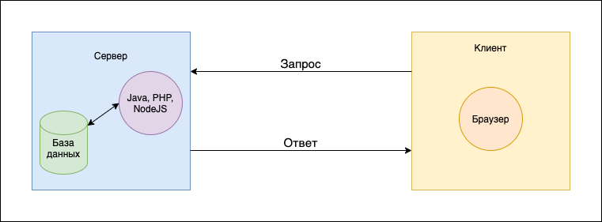

# HTTP. AJAX



## Порядок загрузки страницы

* Пользователь в браузере вводит адрес сайта
* Запрос попадает на сервер
* Обрабатывается бекендом
* Находим нужный route(маршрут) для нашего запроса
  - http://mydomain.com/products
  - http://mydomain.com/product/1
  - http://mydomain.com/api/cart
* Бекенд подготавливает и отправляет ответ на фронтенд
* Фронтенд обрабатывает ответи и по необходимости реагирует

-----

## HTTP

### Как работает протокол HTTP?

* Запрос
* Ответ
* Методы HTTP
* Код состояний HTTP

#### HTTP Request(Запрос)

```
GET /hello.htm HTTP/1.1
User-Agent: Mozilla/5.0 (Macintosh; Intel Mac OS X 10_15_7) AppleWebKit/537.36 (KHTML, like Gecko) Chrome/85.0.4183.121 Safari/537.36
Host: www.example.com
Accept-Encoding: gzip
```
#### HTTP Response(Ответ)
```
HTTP/1.1 200 OK
Server: nginx/0.6.31
Content-Language: ru
Content-Type: text/html; charset=utf-8
Content-Length: 1234

***Body***
```

### HTTP-codes
* 1xx - информационные
* 2xx - успех
* 3xx - переадресация
* 4xx - ошибка на стороне клиента
* 5xx - ошибка на стороне сервера

[Список HTTP-кодов](https://ru.wikipedia.org/wiki/%D0%A1%D0%BF%D0%B8%D1%81%D0%BE%D0%BA_%D0%BA%D0%BE%D0%B4%D0%BE%D0%B2_%D1%81%D0%BE%D1%81%D1%82%D0%BE%D1%8F%D0%BD%D0%B8%D1%8F_HTTP)

### HTTP-methods (методы)

* GET - URL, заголовки
* POST - URL, заголовки, тело запроса
* PUT - URL, заголовки, тело запроса
* DELETE - URL, заголовки


---

## REST

REST - REpresentational State Transfer) Архитектурный подход

### REST - принципы

* Client - Server architecture
  - Request + Response
  - Request stateless - клиент в курсе о стоянии сервера
  - Кеширование на сервере
    - Если состояние сервера не изменилось - он отдает старый ответ
* Uniform interface
  - Стабильность, предсказуемость

### REST API

  * GET - получаение ресурса
  * POST - создание ресурса
  * PUT - обновление ресурса
  * DELETE - удаление ресурса

#### Пример:
  * **GET** `/users/` - получение всех пользователей
  * **GET** `/users/1` - получение пользователя с id === 1
  * **POST** `/users/` - создание пользователя
    - Данные пользователя в Request Body
  * **PUT** `/users/` - обновление всех пользователей
    - Данные пользователей в Request Body
  * **PUT** `/users/1` - обновление пользователя с id === 1
    - Данные пользователей в Request Body
  * **DELETE** `/users/` - удаление всех пользователей
  * **DELETE** `/users/1` - удаление пользователя с id === 1
  
---

## AJAX

AJAX - Asynchronous Javascript and XML (Общение с сервером без перезагрузки страницы)

### Как это работает?

* Обработка некоторого события (нажатие на кнопкуб например)
* Отправка запроса на сервер
* Обработка данных на сервере
* Получение ответа от сервера
* Обработка результата

Данные принято отправлять в формате JSON (иногда XML)

---

## XML

XML - eXtensible Markup Language
* Спецификация описывающая XML-документ


#### Формат XML

```xml
<?xml version="1.0" encoding="UTF-8">
<users>
  <user>
    <name>John</name>
    <age>25</age>
  </user>
  <user>
    <name>Jane</name>
    <age>20</age>
  </user>
</users>
```

### Формат JSON

```json
[{"name": "John","age":25},{"name":"Jane","age":20}]
```
---

## JS + AJAX

Варианты отправки AJAX-запроса:

* XMLHttpRequest
* fetch
* Используя сторонние библиотеки

#### XMLHttpRequest. Синхронный

```js
const xhr = new XMLHttpRequest();
// configuration
xhr.open('GET', 'users.json', false);

xhr.send();
// error
if (xhr.status !== 200) {
  console.log(`${xhr.status}: ${xhr.statusText}`); // For instance, 404: Not Found
} else {
  console.log(xhr.responseText); // Plain list of users
}
```
#### XMLHttpRequest. Асинхронный

```js
const xhr = new XMLHttpRequest();
xhr.open('GET', 'users.json', true); // Флаг true указывает на асихронный запрос
xhr.onreadystatechnage = function() {
  if (xhr.readyState === XMLHttpRequest.DONE ) {
    if (xhr.status !== 200) {
      console.log(`${xhr.status}: ${xhr.statusText}`); // For instance, 404: Not Found
    } else {
      console.log(xhr.responseText); // Plain list of users

    }
  }
}
```

#### fetch()

```js
fetch('users.json')
  .then(function (res) {
    return res.json();
  })
  .then(function (users) {
    console.log(users);
  });
```

```js
const myHeaders = new Headers({
  'Content-Type': 'application/json',
});

fetch('users.json', {
  method: 'GET',
  headers, myHeaders,
})
  .then(res => res.json())
  .then(users => {
    console.log(users);
  });
```

----

## Homework

Создать приложение TODO-list для хранения списка задач:

* Выводить список задач
* Создавать, редактировать и удалять созданные задачи
* Менять задачам статус (Open (default), In progress, Done)
* Менять приоритет задач (Low, Minor, Major, High)
* Данные по всем задачам хранить в localStorage

............

Список возможных статусов, приоритетов и дефолтных задач хранить не в отдельном js-файле, а получать посредством AJAX-запроса к файлу data.json
Если приоритета или статуса задачи нет в конфигурационном файле - отображаем задачу с значением Not Defined на месте несоответствующего значения
