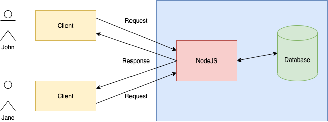

# Lection 25 - NodeJS, NPM.



## NodeJS - basic

* no browser -> server side
* no global "window" object -> "global" object instead
* work with requests, responses

Pros:

* JavaScript
* Fast on I/O operations
* Cross-platform

Cons:

* Slow on CPU intensive operations (video decoding, .etc)


-> `server.js`

## NodeJS - modules

##### CommonJS - NodeJs modules

#### Modules types:

* Core modules
* Local Modules
* Third party modules


#### Core modules:

* http
* url
* path
* fs
* util
* ...


#### Подключение модулей

```js
const module = require('module_name');
```


#### Создание локальных модулей

```js
// my_module.js
const someFunc = () => {
  ...
}

module.exports = {
  someFunc,
}

```

## ES modules

#### Подключение модулей

```js
import module from 'module_name';
```

#### Создание модулей

```js
const someFunc = () => {
  ...
}

export {
  someFunc,
}
```

## NPM 

NPM - NodeJS Package Manager

```sh
npm init
```

#### Добавить библиотеку в проект

```sh
npm install express
```

#### Удалить библиотеку из проекта

```sh
npm uninstall express
```
